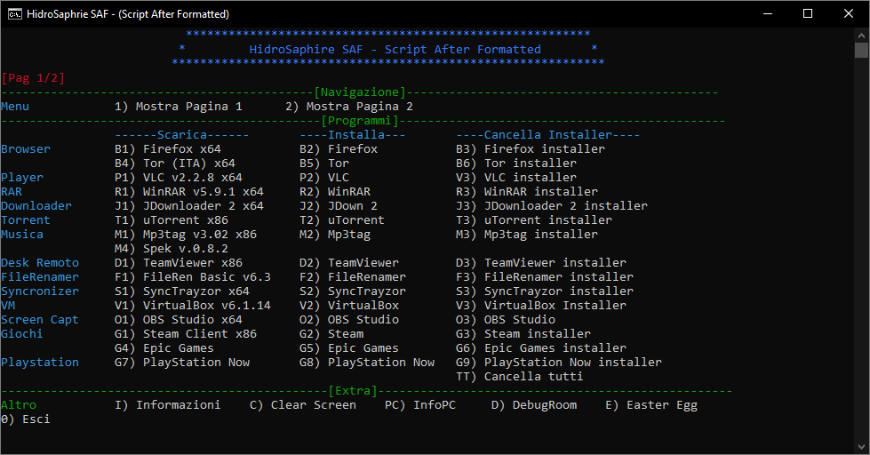

  <h1>SAF - Script After Formatted</h1> 
An useful script (written in Batch) for Windows to download and install programs from web after formatted 

## Download last version (.zip) - [Click Here]

## Author & Developers
 - [Enrico Mancuso] :computer:

## Screenshot

	
	 

## What program is supported?
**Web Browser** = Firefox (Last Version) + Tor (Last Version) 
Why? Because Firefox is a very good open-source browser. The latest version is always the most recommended. 
Tor can be used for gain more privacy!

**Multimedia Player** = VLC x64 (v2.2.8) + Spotify (Last Version) 
Why? Because VLC v3 has many bug IMHO. 
Spotify is one of much used player

**Compression** = WinRAR x64 (Last Version) 
Why? Because it's an excellent and performing program.

**Downloader** = JDownloader 2 (Last Version) 
Why? Because it's a great link-grabber, which supports various formats.

**Torrent** = uTorrent (Last Version) 
Why? Because isn't heavy and does its job!

**Remote Desktop** = TeamViewer (Last Version) 
Why? Is a powerful tool! I'm feel protected with this.

**Music** = Mp3tag (Last Version) + Spek (Last Version) 
Why? Mp3tag because it's easy-to-use and has an User Friendly UI 
Spek because is the best Acoustic Spectrum Analyser which work with every file and is super light!

**File Renamer** = File Renamer Basic (Last Version) 
Why? Is a little complex, but does its job well!

**Syncronizer** = SyncTrayzor (Last Version) - Based on Syncthing 
Why? It synchronizes files between two or more computers in real time, safely protected (with TLS) from prying eye! Is simple and powerful! What else?

**Virtual Machine** = VirtualBox (Last Version) 
Why? Because it's work fine, I never had a problem with it!

**Screen Capture** = OBS Studio (Last Version) 
Why? Because it's simple and work fine!

**PC Monitor** = MSI Afterburner (Last Version) 
Why? Because is a "must have" application for who wants test the performance of their own pc! 

**Games** = Steam Client (Last Version) + Epic Games (Last Version) 
Why? Because are the most popular game library among players!

**PlayStation** = PlayStation Now (Last Version) 
Why? Because is an amazing services!

**Controller** = DS4Windows (Last Version) 
Why? Good controller driver for PS4 controller

**Text Editor** = Atom (Last Version) + Notepad++ (Last Version) 
Why? Atom it's a perfect fast editor high customizable! 
Notepad++ is a valid alternative

**Developer** = Code::Blocks + Mingw (Last Version) 
Why? Simple and good IDE with a powerful compiler!

**Customizatior** = Rainmeter (Beta Version) + RocketDock (Last Version) 
Why? Rainmeter is one of most used desktop customizator ever made! 
RocketDock is a "Mac Dock-like" really good!

**Recovery** = Recuva (Last Version) 
Why? Recuva is the best file recovery software I ever used!

## Will you give support to other programs?
Of couse! I'm working on it!
Do you have a request? Open an issue, or write me!

## What functionality is supported?
+ AMD / NVIDIA video driver fast link
+ TRIM check
+ Windows Update Reconfiguration
+ Windows Store reset
+ NIC (Network Interface Card) reset
+ DHCP, ARP, NetBIOS, DNS and IP reset

[Click Here]: https://github.com/HidroSaphire/Script-After-Formatted/archive/master.zip
[Enrico Mancuso]: https://github.com/HidroSaphire
