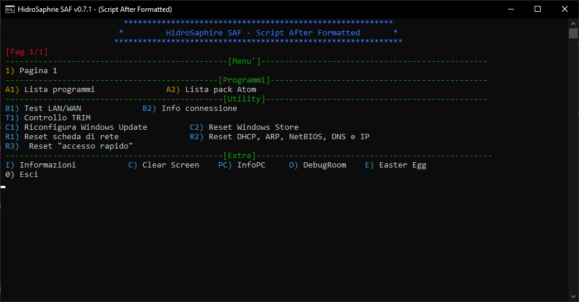

  <h1>SAF - Script After Formatted</h1>

## Download last version (.zip) :floppy_disk: - [Click Here]

## What is it?
SAF is an useful script (written in [Batch]) for [Microsoft Windows]. Includes a number of features to test the operating system and the computer, useful after installing Windows (after formatting)

## Author & Developers
 - [Enrico Mancuso] :computer:

## Screenshot :camera:

	
	 

## What functionality is supported? :hammer:
+ AMD / NVIDIA video driver fast link
+ TRIM check
+ Windows Update Reconfiguration
+ Windows Store reset
+ NIC (Network Interface Card) reset
+ DHCP, ARP, NetBIOS, DNS and IP reset
+ Windows "Quick Access" reset
+ Connection Test (LAN / WAN)
+ Connection's Information

## Old Version Screenshot :camera:

	
	 

[Click Here]: https://github.com/HidroSaphire/Script-After-Formatted/archive/master.zip
[Enrico Mancuso]: https://github.com/HidroSaphire
[Batch]: https://en.wikipedia.org/wiki/Batch_file
[Microsoft Windows]: https://en.wikipedia.org/wiki/Windows_10
[issue]: https://github.com/HidroSaphire/Script-After-Formatted/issues/new/choose
